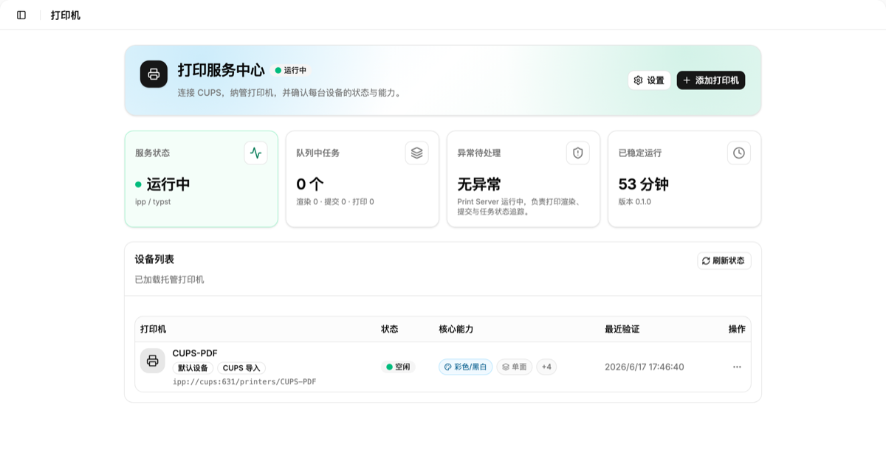
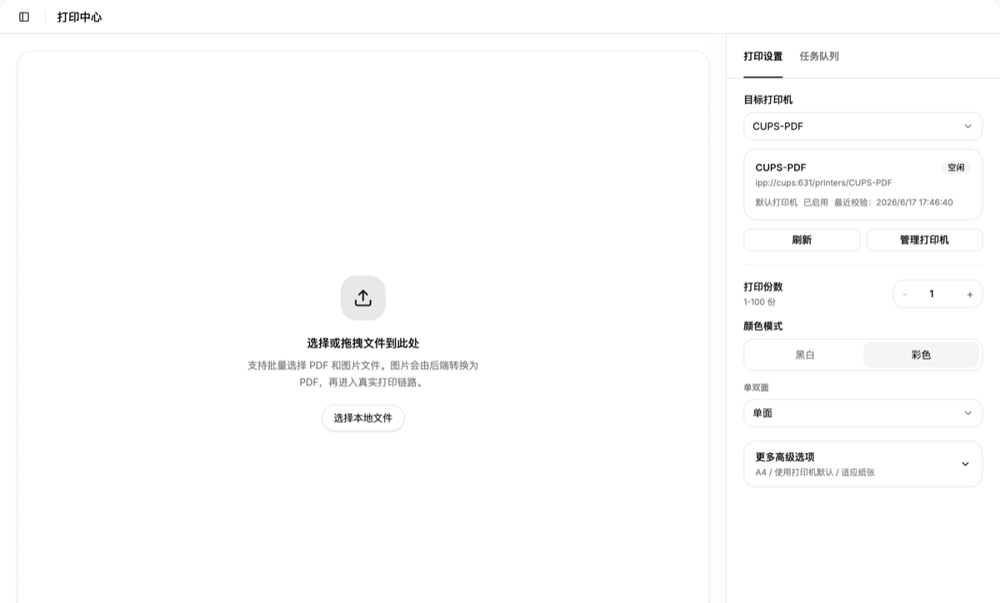
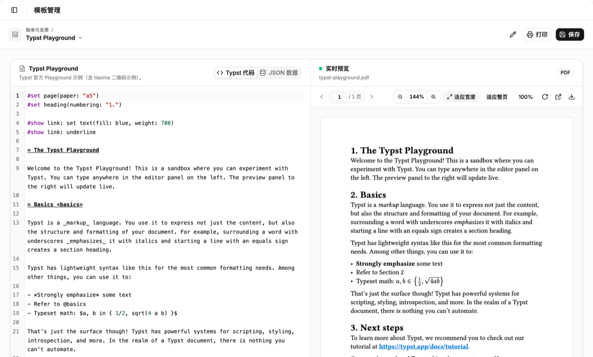

# DeepPrint Studio

DeepPrint Studio 是一个面向私有部署的 Web 打印中心。它把模板渲染、打印机管理、CUPS 打印链路和外部系统 Open API 收敛到一套浏览器可访问的服务里，适合订单、标签、票据、PDF 文件等场景。

用户通过浏览器访问 Web 控制台，服务端通过 CUPS 连接虚拟 PDF 打印机、局域网打印机或 Linux USB 打印机。

## 功能亮点

- Web 控制台：打印中心、模板管理、打印机管理、打印记录、用户管理、API Key 管理。
- 模板打印：使用 Typst 模板和 JSON 数据生成 PDF 并提交打印。
- 文件直打：支持 PDF/图片等文件直接提交打印。
- CUPS 集成：从当前 CUPS 发现打印机，读取打印机能力，并按能力提交参数。
- CUPS-PDF 调试：无需真实打印机也能跑通真实 IPP 链路并检查输出 PDF。
- Open API：外部系统可用 Bearer API Key 调用模板、打印机、预览、打印和任务查询接口。
- 本地账号：Web 控制台使用 Session Cookie，支持管理员、操作员、首登改密和用户管理。
- 私有部署：默认 SQLite，Docker Compose 一键启动 Web、Server 和 CUPS。

## 未来规划 (Roadmap)

- [x] 基于 CUPS 的打印机底层链路管理
- [x] Typst 现代排版引擎集成
- [x] 标准对外 API 接口
- [ ] AI 智能联动：支持通过自然语言（Prompt）自动生成与调整打印模板

## 界面预览

默认截图基于本仓库 Docker Compose 本地运行环境，展示的是收起左侧导航后的桌面态控制台。

### 打印机管理



### 打印中心



### 模板管理（Typst 官方 Playground 示例）



## 适用场景

- 内网订单/标签/票据打印中心。
- 需要把业务系统的打印能力统一接到 CUPS。
- 希望用模板 + JSON 数据生成可打印 PDF。
- 希望先用 CUPS-PDF 验证真实打印链路，再接入物理打印机。

## 快速体验

如果你是使用者，只想启动整个系统，准备下面这些即可：

- Docker
- Docker Compose

方式一：本地构建并启动完整容器栈：

```bash
cp .env.example .env
docker compose up -d --build
```

方式二：不在本地构建，直接使用最新预构建镜像：

```bash
cp .env.example .env
docker compose -f docker-compose.ghcr.yml pull
docker compose -f docker-compose.ghcr.yml up -d
```

`docker-compose.ghcr.yml` 默认使用：

- `ghcr.io/boe1900/deepprint-server:edge`
- `ghcr.io/boe1900/deepprint-web:edge`

如果你不想跟随最新预发布镜像，也可以固定到某次构建产物：

```bash
DEEPPRINT_SERVER_IMAGE=ghcr.io/boe1900/deepprint-server:sha-<commit> \
DEEPPRINT_WEB_IMAGE=ghcr.io/boe1900/deepprint-web:sha-<commit> \
docker compose -f docker-compose.ghcr.yml up -d
```

访问入口：

- Web 控制台：`http://localhost:8080`
- Server API：`http://localhost:17801`
- CUPS Admin：`http://localhost:631/admin`

CUPS 默认账号来自 `.env.example`：

- 用户：`print`
- 密码：`print`

首次登录 Web 控制台前，请在 `.env` 里设置初始管理员密码：

```bash
DEEPPRINT_INITIAL_ADMIN_USERNAME=admin
DEEPPRINT_INITIAL_ADMIN_PASSWORD=change-me-min-8
```

如果数据库中已经存在用户，服务端不会重复创建初始管理员。初始管理员首次登录后必须修改密码。

如果没有设置 `DEEPPRINT_INITIAL_ADMIN_PASSWORD`，登录页会直接显示初始化引导，不会给出一个其实无法登录的表单。

常规部署通常只需要修改初始管理员密码和端口。更多环境变量说明见 [开发、部署与运维](./docs/development-and-operations.md#7-环境变量)。

容器部署下，DeepPrint 管理的 Typst 资源默认会落在持久化的 `/data` 卷里：

- 包目录：`/data/typst/packages`
- 字体目录：`/data/typst/fonts`
- 预览缓存：`/data/cache/typst`

`/data/typst/fonts` 是唯一受管字体目录。服务启动时会把镜像内置的几款免费字体自动同步到这里，后续业务字体也统一上传到这个目录，不再额外区分系统字体目录。

仓库自带的 `docker-compose.yml` 现在使用 Docker 命名卷 `deepprint-data` 持久化 `/data`，不再把容器数据库直接绑到宿主机目录。这样更接近真实部署，也能避免 macOS / Docker Desktop 下 SQLite 在 bind mount 上的稳定性问题。

## 预发布镜像

仓库现在可以通过 GitHub Actions 自动构建并发布 GHCR 预发布镜像：

- `ghcr.io/<owner>/deepprint-server:edge`
- `ghcr.io/<owner>/deepprint-web:edge`
- `ghcr.io/<owner>/deepprint-server:sha-<commit>`
- `ghcr.io/<owner>/deepprint-web:sha-<commit>`

当前策略只发布预发布标签，不发布 `latest`。所以如果你不想自己本地构建，推荐直接使用 `edge`，或者固定到某个 `sha-...` 标签。

当前 GHCR 预发布镜像同时支持 `linux/amd64` 和 `linux/arm64`，并已在 ARM NAS 上配合 `hanxi/cups:latest` 跑通 CUPS-PDF 演练。

当前镜像验证范围以 Docker Compose、CUPS-PDF、Typst 渲染链路和 Web 控制台为主；真实物理打印机链路还需要进一步实机验证。首次对外推荐优先使用 `edge` 或固定的 `sha-...` 标签。

## 用 CUPS-PDF 验证打印链路

`hanxi/cups` 镜像预装 `printer-driver-cups-pdf`，可以用虚拟打印机验证完整链路。

初始化 CUPS-PDF：

```bash
bun run compose:setup-cups-pdf
```

这个脚本会同时创建打印机、固定 CUPS-PDF 输出路径，并把 PDF 输出目录调整为容器内可写，避免 NAS / bind mount 场景出现“打印任务成功但没有 PDF 文件”的假成功。

然后在 Web 控制台中从当前 CUPS 导入 `CUPS-PDF` 打印机，提交一次打印。

默认输出目录：

```text
./.deepprint-dev/cups-pdf/ANONYMOUS
```

这条链路会真实经过：

1. DeepPrint 渲染 PDF
2. DeepPrint 通过 IPP 提交到 CUPS
3. CUPS 路由到 `CUPS-PDF`
4. `CUPS-PDF` 写出最终 PDF 文件

## Open API

外部系统使用 API Key 调用：

```text
Authorization: Bearer dp_...
```

常用接口：

| 接口 | Scope | 说明 |
| --- | --- | --- |
| `GET /v1/open/me` | 有效 API Key | 当前 API Key 元信息 |
| `GET /v1/open/templates` | `template:read` | 读取模板 |
| `GET /v1/open/printers` | `printer:read` | 读取打印机列表 |
| `GET /v1/open/printers/{printer_id}` | `printer:read` | 读取打印机能力 |
| `POST /v1/open/preview` | `preview:create` | 生成 PDF 预览 |
| `POST /v1/open/print` | `print:create` | 模板打印 |
| `POST /v1/open/print/direct` | `print:create` | multipart 文件直打 |
| `GET /v1/open/jobs/{job_id}` | `job:read` | 查询任务 |
| `GET /v1/open/jobs/by-request-id/{request_id}` | `job:read` | 按业务请求 ID 查询任务 |

文件直打示例：

```bash
curl -X POST "http://localhost:17801/v1/open/print/direct" \
  -H "Authorization: Bearer $DEEPPRINT_API_KEY" \
  -F "request_id=erp-file-1001" \
  -F "printer_id=printer-xxx" \
  -F 'print_options={"copies":1,"media":"iso_a4_210x297mm"}' \
  -F "file=@invoice.pdf;type=application/pdf"
```

更多接口和参数说明见 [系统设计](./docs/system-design.md)。

## 本地开发

开发者模式需要：

- Bun 1.x
- Rust stable
- Docker 与 Docker Compose

先安装前端依赖：

```bash
bun install
```

推荐开发模式是 CUPS 跑在 Docker，Server 和 Web 跑在宿主机：

```bash
bun run dev:local
```

然后分别启动：

```bash
bun run server:dev
```

```bash
bun run web:dev
```

本地开发入口：

- Web 控制台：`http://localhost:3000`
- Server API：`http://localhost:17801`
- CUPS Admin：`http://localhost:631/admin`

说明：

- `server:dev` 会读取根目录 `.env`，但会把数据库、Typst 资源、日志和诊断目录固定到 `./.deepprint-dev/`，避免把容器专用 `/data/...` 路径带到宿主机。
- `server:dev` 会忽略 `.env` 里的 `DEEPPRINT_DATABASE_URL`，所以开发时可以直接复用 Docker 部署用的 `.env`。
- `web:dev` 会自动跟随 `DEEPPRINT_SERVER_PORT` 或 `DEEPPRINT_AGENT_PORT` 调整本地代理目标，不再写死 `17801`。

常用命令：

```bash
bun run web:build
bun run server:check
bun run server:test
```

Open API / API Key 相关改动建议额外执行：

```bash
cargo test --manifest-path apps/server/Cargo.toml open_ --quiet
cargo test --manifest-path apps/server/Cargo.toml api_key --quiet
```

## 文档

- [系统设计](./docs/system-design.md)
- [开发、部署与运维](./docs/development-and-operations.md)
- [第三方致谢与许可证说明](./THIRD_PARTY_NOTICES.md)

## 参与和支持

- [贡献指南](./CONTRIBUTING.md)
- [安全策略](./SECURITY.md)
- [支持说明](./SUPPORT.md)

## 项目结构

```text
.
├── apps/
│   ├── server/              # Rust server
│   └── web/                 # Vite + React + TanStack app
├── docker/                  # 容器镜像与启动资源
├── docs/                    # 系统设计、开发部署运维
├── scripts/                 # load / soak / recovery / smoke 验证脚本
├── docker-compose.yml
└── docker-compose.usb.yml
```

## 项目状态

- 默认数据库是 SQLite，PostgreSQL 是后续规划。
- 推荐打印后端是 external CUPS。
- Web 控制台已接入本地用户、Session Cookie 和用户管理。
- Open API 已接入 Bearer API Key 和 scope 鉴权。

## 致谢

DeepPrint Studio 的 CUPS 开发环境使用 [hanxi/cups](https://github.com/hanxi/cups-web) 镜像。这个项目把家用 USB 打印机变成可通过网页访问的网络打印服务，并预装了 `printer-driver-cups-pdf`，非常适合用来调试真实 CUPS / IPP 打印链路。

模板渲染能力基于 [Typst](https://typst.app/) 生态。Typst 是现代化的开源排版系统，适合用简洁的标记语言生成高质量 PDF。

更多第三方项目和许可证说明见 [第三方致谢与许可证说明](./THIRD_PARTY_NOTICES.md)。

## License

DeepPrint Studio is licensed under the [Apache License 2.0](./LICENSE).
