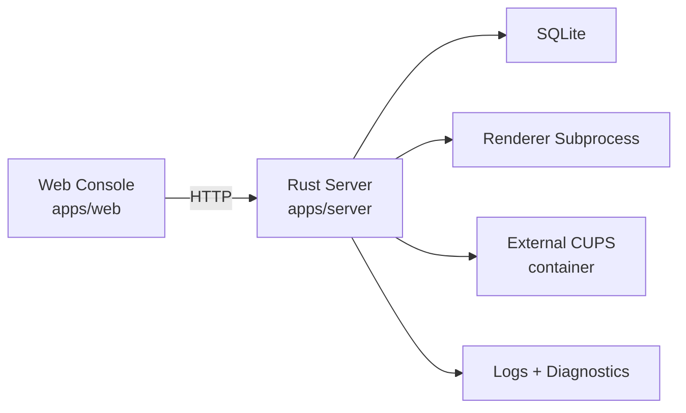

# DeepPrint Studio 系统设计

本文档描述 DeepPrint Studio 的系统边界、核心流程、认证模型和 Open API 契约。

## 1. 当前定位

DeepPrint Studio 是一个 Web + Rust Server + external CUPS 的系统：

- Web 控制台负责操作界面与数据展示
- Rust 服务端负责打印任务、渲染、鉴权、诊断与存储
- CUPS 通过容器引入，不再依赖客户端本机安装



## 2. 代码地图

| 模块 | 关键位置 | 说明 |
| --- | --- | --- |
| Web 控制台 | `apps/web/src` | 页面、路由、查询、前端交互 |
| 前端业务核心 | `apps/web/src/features/deepprint/**` | 打印、模板、打印机和任务数据流 |
| Rust 服务端 | `apps/server/src/main.rs` | 服务启动入口 |
| Server 核心 | `apps/server/src/print_server.rs` | HTTP API、任务状态机、SQLite、诊断 |
| 打印后端 | `apps/server/src/printer.rs`, `apps/server/src/print_backend/**` | CUPS 主线与测试用 Mock 抽象 |
| 渲染层 | `apps/server/src/print_server/rendering/**` | Typst / text 渲染与预览 |
| 运维脚本 | `scripts/*.mjs` | loadtest / soaktest / recovery / compose smoke |
| 容器部署 | `docker-compose.yml`, `docker/` | Web、Server、CUPS 组合部署 |

## 3. 分层职责

Web 层负责页面路由、表单交互、TanStack Query 数据读取和写操作发起，不负责本地打印环境管理。

Server 层负责 API、任务入队、调度、重试、恢复、SQLite 持久化、Typst 渲染、打印提交、状态查询和诊断包导出。

CUPS 层负责打印机管理、打印队列和 CUPS Admin。当前以 external CUPS 容器模式为准，DeepPrint 不启动、停止、升级或回滚 CUPS runtime。

## 4. 认证与授权

当前部署模型按单实例单租户设计，不引入 `organization_id`。典型场景是一套服务对应一个企业、家庭或个人实例。

认证边界：

- Web 控制台：本地用户 + 服务端 Session Cookie
- Open API：Bearer API Key + scope

Web 登录流程：

1. 用户提交用户名/邮箱和密码
2. Server 校验本地身份
3. Server 创建 session
4. Server 返回 HttpOnly Cookie
5. 前端通过 `/v1/auth/me` 获取当前用户

用户角色：

- `admin`：用户管理、API Key 管理和业务功能
- `operator`：业务功能，不允许进入用户管理接口

当前约束：

- 不允许禁用、删除或降级最后一个 active admin
- 初始管理员和被重置密码的用户必须先修改密码
- API Key 只能由控制台 admin 管理

## 5. Open API

Open API 使用：

```text
Authorization: Bearer dp_...
```

已开放接口：

| 接口 | Scope | 说明 |
| --- | --- | --- |
| `GET /v1/open/me` | 有效 API Key | 当前 API Key 元信息 |
| `GET /v1/open/templates` | `template:read` | 模板工作区 |
| `GET /v1/open/printers` | `printer:read` | 已纳管打印机列表 |
| `GET /v1/open/printers/{printer_id}` | `printer:read` | 打印机详情和能力 |
| `POST /v1/open/preview` | `preview:create` | 按模板生成 PDF 预览 |
| `POST /v1/open/print` | `print:create` | 按模板创建打印任务 |
| `POST /v1/open/print/direct` | `print:create` | multipart 文件直打 |
| `GET /v1/open/jobs/{job_id}` | `job:read` | 按任务 ID 查询 |
| `GET /v1/open/jobs/by-request-id/{request_id}` | `job:read` | 按业务请求 ID 查询 |

当前支持的 scope：

- `template:read`
- `printer:read`
- `preview:create`
- `print:create`
- `job:read`

不再提供 `credential:manage` 这类 Open API scope。API Key 管理由 Web Session + admin 角色保护。

### 5.1 打印参数

打印参数通过 `print_options` 传入，字段名使用 JSON 驼峰形式：

| 字段 | 类型 | 对应 CUPS/IPP 能力 |
| --- | --- | --- |
| `copies` | number | `copies` |
| `media` | string | `media-supported` |
| `mediaType` | string | `media-type-supported` |
| `sides` | string | `sides-supported` |
| `printColorMode` | string | `print-color-mode-supported` / `color-supported` |
| `orientationRequested` | string | `orientation-requested-supported` |
| `printScaling` | string | `print-scaling-supported` |
| `pageRanges` | string | `page-ranges-supported` |

外部系统应先调用 `GET /v1/open/printers/{printer_id}` 获取能力，再只提交该打印机声明支持的字段和值。后端会校验能力，未声明或不支持的参数会返回错误。

### 5.2 模板打印示例

```json
{
  "request_id": "erp-order-1001",
  "template_id": "template-xxx",
  "printer_id": "printer-xxx",
  "data": { "orderNo": "1001" },
  "print_options": {
    "copies": 1,
    "media": "iso_a4_210x297mm",
    "sides": "one-sided",
    "printColorMode": "monochrome"
  }
}
```

`request_id` 是调用方业务幂等 ID。`POST /v1/open/print` 和 `POST /v1/open/print/direct` 使用相同 `request_id` 重复提交时，会返回已有任务。

### 5.3 文件直打示例

开放接口的 direct print 使用 `multipart/form-data`，避免 base64 膨胀：

```bash
curl -X POST "$DEEPPRINT_BASE_URL/v1/open/print/direct" \
  -H "Authorization: Bearer $DEEPPRINT_API_KEY" \
  -F "request_id=erp-file-1001" \
  -F "printer_id=printer-xxx" \
  -F 'print_options={"copies":1,"media":"iso_a4_210x297mm"}' \
  -F "file=@invoice.pdf;type=application/pdf"
```

控制台内部的 `/v1/jobs/direct` 仍接受 JSON + `file_content_base64`，这是 Web 控制台内部接口，不推荐作为外部系统接入方式。

## 6. 控制台 API

主要控制台接口：

- `GET /v1/health`
- `GET /v1/health/deep`
- `POST /v1/auth/login`
- `POST /v1/auth/logout`
- `GET /v1/auth/me`
- `POST /v1/auth/change-password`
- `GET /v1/users`
- `POST /v1/users/create`
- `POST /v1/users/{user_id}/update`
- `POST /v1/users/{user_id}/reset-password`
- `POST /v1/users/{user_id}/delete`
- `GET /v1/api-keys`
- `POST /v1/api-keys/create`
- `POST /v1/api-keys/{api_key_id}/revoke`
- `GET /v1/printers`
- `GET /v1/printers/discover/cups`
- `POST /v1/printers`
- `GET /v1/templates/workspace`
- `POST /v1/jobs`
- `POST /v1/jobs/direct`
- `GET /v1/jobs/{job_id}`
- `GET /v1/jobs/recent`
- `POST /v1/preview/typst`
- `GET /v1/settings/cups`
- `POST /v1/settings/cups`
- `POST /v1/settings/cups/test`
- `POST /v1/diagnostics/export`

边界：

- `GET /v1/health` 公开，用于部署探活
- 有本地登录用户后，控制台业务接口要求有效 session
- `/v1/open/*` 不使用 session，使用 API Key

## 7. 核心业务流程

### 模板打印

1. Web 或 Open API 创建模板打印任务
2. Server 写入 SQLite 并入队
3. Worker 推进到 `rendering`
4. Renderer 产出 PDF
5. 任务进入 `printing`
6. Server 通过 CUPS/IPP 提交打印
7. 最终进入 `succeeded / failed / canceled`

### 文件直打

1. Web 或 Open API 上传可打印文件
2. Server 校验打印机能力和打印参数
3. Server 跳过 Typst 渲染
4. 直接进入打印提交流程

### 崩溃恢复

服务重启时会回收 `rendering` / `printing` 中的任务，并重新排队处理。

## 8. 存储模型

当前主存储是 SQLite：

- `users`
- `auth_identities`
- `sessions`
- `api_keys`
- `printers`
- `templates`
- `template_groups`
- `jobs`
- `job_events`
- `render_cache`
- `dead_letters`

当前服务端只支持 SQLite。PostgreSQL 按后续阶段预留，但尚未落地。

密码使用 Argon2id；Session token 和 API Key secret 只保存 hash，不保存明文。

## 9. 后续边界

已确定：

- external CUPS 是当前标准接法
- Web 控制台已接入本地用户、Session Cookie、用户管理与 API Key 管理
- Open API 已接入 Bearer API Key、scope 鉴权和打印机能力读取

后续重点：

- 审计日志
- 按 API Key / IP 限流
- 更完整的企业认证扩展，LDAP / OIDC 只负责身份认证，DeepPrint 仍负责本地授权
- PostgreSQL 存储层
